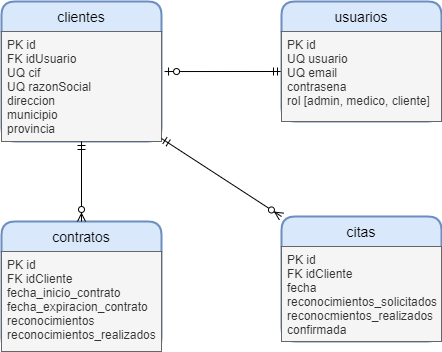

# Proyecto para la gestión de citas médicas

## Inicio del proyecto

- **Stack tecnológico**

    - Frontend: Angular 12
    - Backend: NestJS 8
    - DB: MariaDB
    - ORM: TypeORM

- **Fases con alcance funcional y estimación de horas**

    |Función|Estimación|
    |---|---|
    |Especificaciones y UML|2h|
    |---|---|
    |Backend: Gestión de clientes|2h|
    |Backend: Reserva de citas|2h|
    |Backend: Realización de citas|2h|
    |Backend: Acceso al sistema|2,5h|
    |Backend: Carga de datos de ejemplos|2h|
    |Testing backend|2h|
    |---|---|
    |Frontend: Gestión de clientes|2h|
    |Frontend: Reserva de citas|2h|
    |Frontend: Realización de citas|2h|
    |Frontend: Acceso al sistema|2,5h|
    |Testing frontend|2,5h|
    |---|---|
    |Testing de integración|2,5h|
    |Dockerizar|1,5h|
    |Mejoras|10h|
    |---|---|
    |**Total**|**40h**|

- **Fecha de entrega**: 22/07/2021

- **Diagrama relacional**

    